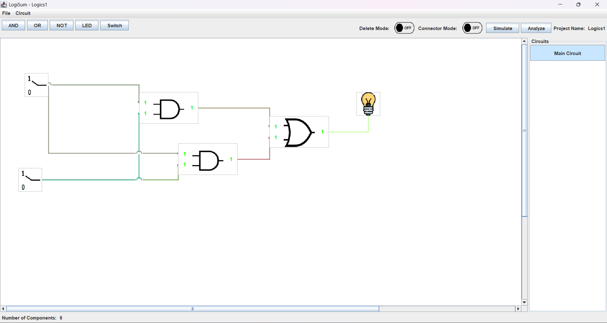
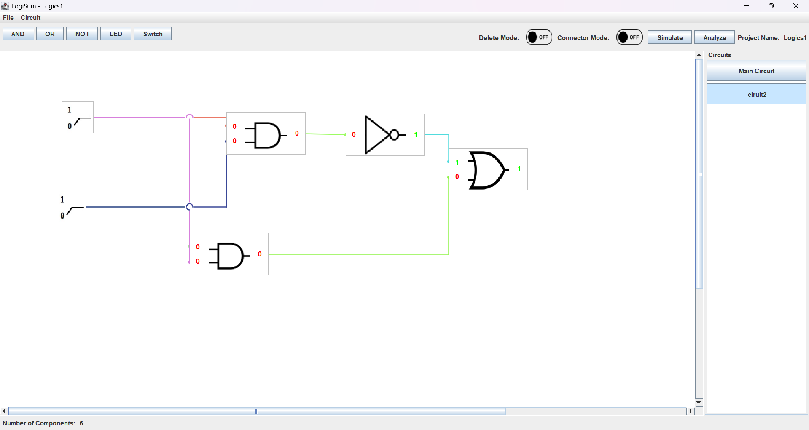
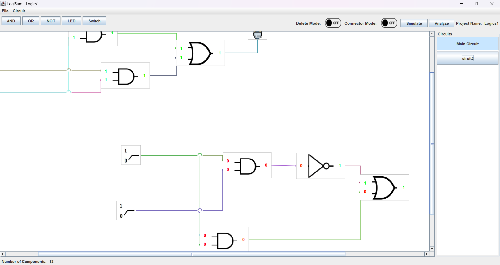
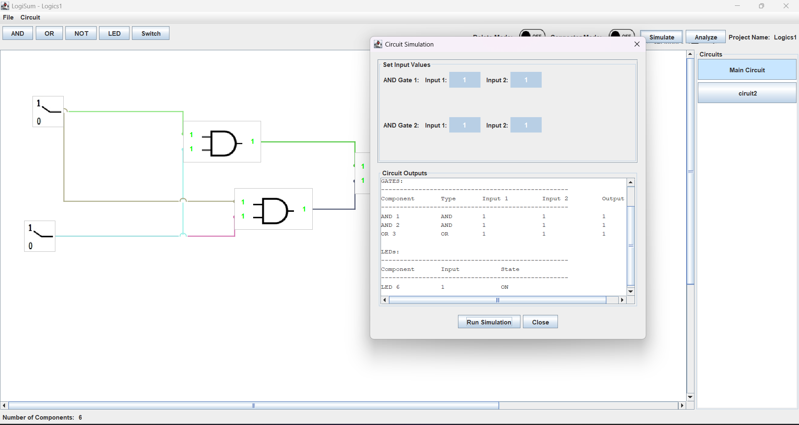

# LogiSim - FAST NUCES

## Project Overview
**LogiSim** is a Java Swing-based logic circuit simulator developed as a semester project for **Software Construction and Development**.  
The application allows users to **create, visualize, and simulate digital logic circuits** using standard components such as logic gates and connectors.  
It supports multiple circuits per project, sub-circuits, and provides truth table analysis for designed circuits.

## University Details
**University:** FAST National University of Computer and Emerging Sciences  
**Campus:** Lahore  
**Semester:** 5th Semester, BS Software Engineering  
**Course:** Software Construction and Development  
**Instructor:** Dr. Farooq Ahmed  

## Contributors
- **Muhammad Ahmad Butt**  
  - **Roll Number:** 23L-3059  
  - **GitHub:** [m-ahmad-butt](https://github.com/m-ahmad-butt)

- **Arham Basit**  
  - **Roll Number:** 23L-3016  
  - **GitHub:** [Arham-codes](https://github.com/Arham-codes)

- **Abd Ur Rehman**  
  - **Roll Number:** 23L-3105  
  - **GitHub:** [A-noob-in-coding](https://github.com/A-noob-in-Coding)

## Tech Stack
- **Language:** Java  
- **Framework:** Swing (GUI), JUnit  
- **Build Tool:** Maven, ANT  
- **Version Control:** Git & GitHub  

## Features
- **Project Management**
  - Create, save, and load circuit projects  
  - Support for multiple circuits and sub-circuits  

- **Circuit Design**
  - Component palette with logic gates (AND, OR, NOT.)  
  - Connect components using wires/connectors  
  - Adjustable layout and component positioning  
  - Export circuit diagrams to PNG  

- **Simulation**
  - Run simulations by providing input values  
  - Observe circuit outputs dynamically  
  - Generate and analyze complete truth tables  

- **User Interface**
  - Intuitive and easy-to-use Swing-based GUI  
  - Layered architecture separating UI, logic, and data

## Screenshots

**Fig: Main_Circuit.png**


**Fig: Circuit_2.png** -


**Fig: multi_circuits.png**


**Fig: Simulate.png** 

## How to Run

### Prerequisites
Make sure you have **Java Development Kit (JDK)** and **Apache Maven** installed and properly configured in your system PATH.

You can verify installations by running these commands in your terminal:

```bash
java --version
mvn --version
ant -v
```
## Expected version:

```
java 24.0.2
Apache Maven 3.9.11
Apache Ant(TM) version 1.10.15
```

### Steps to Run

1. **Clone the repository:**

   ```bash
   git clone https://github.com/m-ahmad-butt/LogiSim.git
   ```

2. **Open in IDE:**

   * Open the project in **IntelliJ IDEA** or **Visual Studio Code**.
   * Ensure Maven dependencies are downloaded automatically.

3. **Build and Run:**

   * Run the project from your IDE or use the following Maven commands:

     ```bash
     mvn compile
     java -cp target/classes org.scd.Main
     ```

© This project is developed as an academic exercise for the Software Construction and Development course. All gate PNGs used in this project are for educational purposes from Wikipedia.
